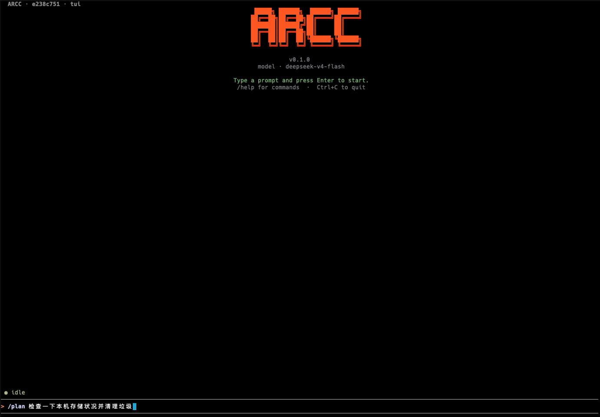

# ARCC

**ARCC (AI Rust Claude CLI)** — Three-in-One Personal AI Assistant.

[](https://www.rust-lang.org)
[](https://deepseek.com)



---

## Running Modes

| Mode | Command | Use Case |
|------|---------|----------|
| **TUI** | `arcc tui` | [交互式终端教程](docs/tui-tutorial.md) |
| **CLI** | `arcc cli "<prompt>"` | [单轮执行教程](docs/cli-tutorial.md) |
| **Server** | `arcc server --daemon` | [HTTP 后台教程](docs/server-tutorial.md) |

## Quick Start

需要你只需一个 DeepSeek API Key：

```bash
# 安装
curl -fsSL https://raw.githubusercontent.com/niyongsheng/arcc/main/scripts/install.sh | bash

# 配置 API Key
echo '[model]
api_key = "sk-xxxxxxxxxxxxxxxxxxxxxxxxxxxxxxxx"' > ~/.arcc/config.toml
```

## Architecture


## License

MIT
