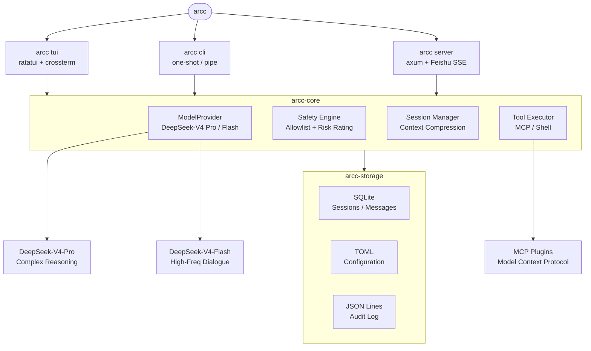

# ARCC

**ARCC (AI Rust Claude CLI)** — Three-in-One Personal AI Assistant.

[](https://www.rust-lang.org)
[](https://deepseek.com)


---

## Running Modes

| Mode | Command | Use Case |
|------|---------|----------|
| **TUI** | `arcc tui` | ClaudeCode-like tool |
| **CLI** | `arcc cli "<prompt>"` | A2A pipe-friendly |
| **Server** | `arcc server --daemon` | Auto CPIS with IM |

## Installation

```bash
curl -fsSL https://raw.githubusercontent.com/niyongsheng/arcc/main/scripts/install.sh | bash
```

Create `~/.arcc/config.toml` with your DeepSeek API key:

```toml
[model]
api_key = "sk-xxxxxxxxxxxxxxxxxxxxxxxxxxxxxxxx"
```

See [config/config.toml](config/config.toml) for all available options.

## Architecture



## License

MIT
