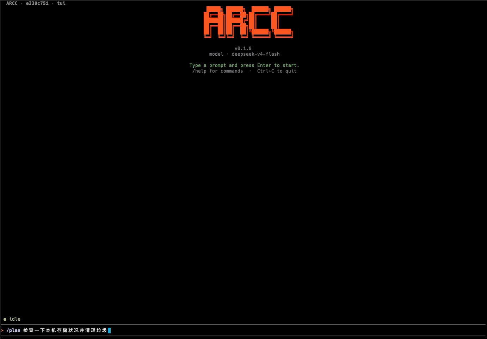

# ARCC

**[ARCC](https://juejin.cn/post/7650384140925812751) (A Rust Copilot CLI)** — Rust-based local-first AI Agent with CLI/TUI/Server modes, supports MCP & ACP protocols, connected to DeepSeek/Claude/OpenAI, built-in safety engine and SQLite persistence.

[](https://www.rust-lang.org)
[](https://deepseek.com)
[](https://modelcontextprotocol.io)
[](https://github.com/nicepkg/acp)
[](https://github.com/niyongsheng/arcc/actions/workflows/ci.yml)
[](https://github.com/niyongsheng/arcc/releases)



---

## Features

- **🤖 Dual-Model Scheduling** — Complex tasks → DeepSeek-V4-Pro (reasoning); routine chat → DeepSeek-V4-Flash (speed). Auto-rotate when context exceeds 800k tokens.
- **🔌 MCP & ACP Protocols** — Native Model Context Protocol client for plugin tool registration. Agent Communication Protocol support for inter-agent collaboration.
- **🛡️ Safety Engine** — 3-layer defense: command allowlist → risk rating → TUI interactive confirm (y/a/n) for dangerous operations.
- **💾 SQLite Persistence** — Sessions, messages, token usage persisted locally via rusqlite (bundled, zero system deps).
- **📋 Audit Logging** — All command executions, MCP calls, and human approvals recorded to JSON Lines for traceability.
- **🧠 Context Compression** — Automatic summarization at token threshold (default ~800k), preserving decisions and pending items.
- **⚡ 3 Running Modes** — **TUI** (ratatui, ~60fps, multi-turn), **CLI** (one-shot/pipe, portable-pty), **Server** (axum, Feishu SSE webhook).
- **🔒 Local-First** — All data stays on your machine. No cloud sync, no telemetry, no external dependencies beyond the model API.

## Protocol Support

| Protocol | Support | Purpose |
|----------|:-------:|---------|
| **MCP** (Model Context Protocol) | ✅ Client | Register external tools as MCP plugins |
| **ACP** (Agent Communication Protocol) | ✅ | Inter-agent message routing & collaboration |
| **SSE** (Server-Sent Events) | ✅ | IM bot push (Feishu webhook) |

## Running Modes

| Mode | Command | Multi-Turn | Memory | Tool Call | Session Persist | Script/Pipe | IM Bot |
|------|---------|:----------:|:------:|:---------:|:---------------:|:-----------:|:------:|
| [**TUI**](doc/tutorial/tui-tutorial.md) | `arcc tui` | ✅ | — | ✅ | ✅ | — | — |
| [**CLI**](doc/tutorial/cli-tutorial.md) | `arcc cli "<prompt>"` | — | — | ✅ | — | ✅ | — |
| [**Server**](doc/tutorial/server-tutorial.md) | `arcc server --daemon` | ✅ | ✅ | ✅ | ✅ | — | ✅ |

## Quick Start

You need one [DeepSeek API Key](https://platform.deepseek.com)：

```bash
# install
curl -fsSL https://raw.githubusercontent.com/niyongsheng/arcc/main/scripts/install.sh | bash

# API Key
echo '[model]
api_key = "sk-xxxxxxxxxxxxxxxxxxxxxxxxxxxxxxxx"' > ~/.arcc/config.toml
```
See [config/config.toml](config/config.toml) for all available options.

## Development

```bash
cargo build                    # Debug build
cargo run -- tui               # Start TUI interactive mode
cargo run -- cli "<prompt>"    # CLI mode (single-turn, pipe-friendly)
cargo run -- server --daemon   # Start server daemon

cargo build --release          # Release build
```

## Architecture


```mermaid
flowchart TB
    Entry(["arcc"]) --> TUI["arcc tui<br/>ratatui + crossterm"]
    Entry --> CLI["arcc cli<br/>one-shot / pipe"]
    Entry --> Server["arcc server<br/>axum + Feishu SSE"]

    TUI --> Core["arcc-core"]
    CLI --> Core
    Server --> Core

    subgraph Core["arcc-core"]
        Model["ModelProvider<br/>DeepSeek-V4 Pro / Flash"]
        Safety["Safety Engine<br/>Allowlist + Risk Rating"]
        Session["Session Manager<br/>Context Compression"]
        Tools["Tool Executor<br/>MCP / Skill"]
    end

    Model --> DeepSeekPro["DeepSeek-V4-Pro<br/>Complex Reasoning"]
    Model --> DeepSeekFlash["DeepSeek-V4-Flash<br/>High-Freq Dialogue"]

    Core --> Storage["arcc-storage"]
    
    subgraph Storage["arcc-storage"]
        SQLite["SQLite<br/>Sessions / Messages"]
        Config["TOML<br/>Configuration"]
        Audit["JSON Lines<br/>Audit Log"]
    end

    Tools --> MCP["MCP Plugins<br/>Model Context Protocol"]
```

## License

[MIT](./LICENSE)