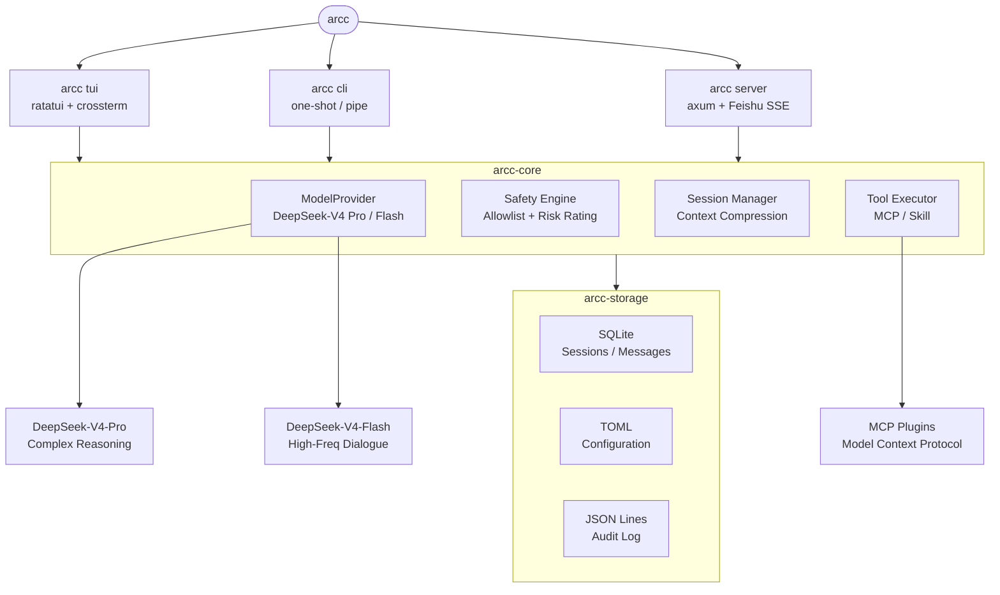

# ARCC

**[ARCC](https://juejin.cn/post/7650384140925812751) (A Rust Copilot CLI)** — Rust-based terminal AI Agent optimized for DeepSeek-V4 thinking mode, with TUI, CLI and Server support.

[](https://www.rust-lang.org)
[](https://deepseek.com)
[](https://github.com/niyongsheng/arcc/actions/workflows/ci.yml)
[](https://github.com/niyongsheng/arcc/releases)


---

## Running Modes

| Mode | Command | Multi-Turn | Memory | Tool Call | Session Persist | Script/Pipe | IM Bot |
|------|---------|:----------:|:------:|:---------:|:---------------:|:-----------:|:------:|
| [**TUI**](doc/tutorial/tui-tutorial.md) | `arcc tui` | ✅ | — | ✅ | ✅ | — | — |
| [**CLI**](doc/tutorial/cli-tutorial.md) | `arcc cli "<prompt>"` | — | — | ✅ | — | ✅ | — |
| [**Server**](doc/tutorial/server-tutorial.md) | `arcc server --daemon` | ✅ | ✅ | ✅ | ✅ | — | ✅ |

## Quick Start

You need one [DeepSeek API Key](https://platform.deepseek.com)：

```bash
# install
curl -fsSL https://raw.githubusercontent.com/niyongsheng/arcc/main/scripts/install.sh | bash

# API Key
echo '[model]
api_key = "sk-xxxxxxxxxxxxxxxxxxxxxxxxxxxxxxxx"' > ~/.arcc/config.toml
```
See [config/config.toml](config/config.toml) for all available options.

## Development

```bash
cargo build                    # Debug build
cargo run -- tui               # Start TUI interactive mode
cargo run -- cli "<prompt>"    # CLI mode (single-turn, pipe-friendly)
cargo run -- server --daemon   # Start server daemon

cargo build --release          # Release build
```

## Architecture


```mermaid
flowchart TB
    Entry(["arcc"]) --> TUI["arcc tui<br/>ratatui + crossterm"]
    Entry --> CLI["arcc cli<br/>one-shot / pipe"]
    Entry --> Server["arcc server<br/>axum + Feishu SSE"]

    TUI --> Core["arcc-core"]
    CLI --> Core
    Server --> Core

    subgraph Core["arcc-core"]
        Model["ModelProvider<br/>DeepSeek-V4 Pro / Flash"]
        Safety["Safety Engine<br/>Allowlist + Risk Rating"]
        Session["Session Manager<br/>Context Compression"]
        Tools["Tool Executor<br/>MCP / Skill"]
    end

    Model --> DeepSeekPro["DeepSeek-V4-Pro<br/>Complex Reasoning"]
    Model --> DeepSeekFlash["DeepSeek-V4-Flash<br/>High-Freq Dialogue"]

    Core --> Storage["arcc-storage"]
    
    subgraph Storage["arcc-storage"]
        SQLite["SQLite<br/>Sessions / Messages"]
        Config["TOML<br/>Configuration"]
        Audit["JSON Lines<br/>Audit Log"]
    end

    Tools --> MCP["MCP Plugins<br/>Model Context Protocol"]
```

## License

[MIT](./LICENSE)